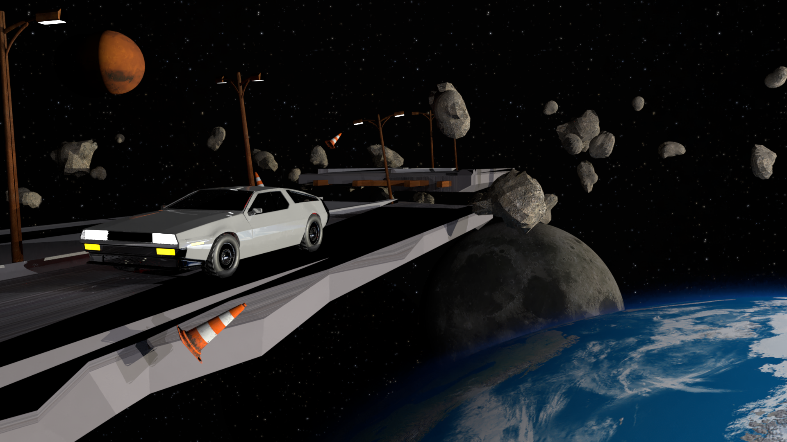

# Computer Graphics Project ETHZ 2022

Programming course project for the 2022 ETHZ [Computer Graphics course](https://cgl.ethz.ch/teaching/cg22/home.php)

---

We extended the Nori v2 ray tracer by adding the following features:
- Images as Texture
- Normal Mapping
- Textured Area Emitters
- NL-means Denoising
- Heterogeneous Participating Media
- Directional Light
- Motion Blur
- Procedural Volume
- Environment Map
- Advanced Camera
- Disney BSDF

For our final image, we wanted to show the beauty of space. To fit the "Out of Place" theme, we wanted to put something random into the scene: For example a car "driving" in space. 

